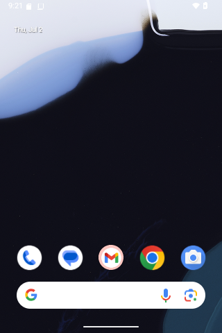

# qemudroid (android-in-docker-qemu)

Google Android Emulator (AVD) running headless in Docker: QEMU + KVM with
SwiftShader software rendering.
**No GPU required**. Everything renders on the CPU.



## Requirements

- x86_64 host with KVM (`/dev/kvm`)
- Docker

## Quick start

```bash
# 1. Build the emulator image (~6.7 GB: Android SDK + system image + AVD)
docker build -f Dockerfile.emulator -t qemudroid-emulator:latest .

# 2. Run (KVM passthrough is required)
docker run -d --name qemudroid \
  --device /dev/kvm \
  -p 127.0.0.1:5554:5554 \
  -p 127.0.0.1:5555:5555 \
  qemudroid-emulator:latest

# 3. Connect
adb connect localhost:5555
adb devices                      # emulator-5554 / localhost:5555
```

Wait for full boot with:

```bash
docker exec qemudroid adb wait-for-device
docker exec qemudroid adb shell getprop sys.boot_completed   # "1" when ready
```

## Build options

| Build arg | Default | Notes |
|-----------|---------|-------|
| `SDK_VERSION` | `36` (Android 16) | AVD profiles exist for 30–37: see `hardware/config_*.ini` |
| `EMULATOR_ARCH` | `x86_64` | `x86` also supported |

```bash
docker build -f Dockerfile.emulator --build-arg SDK_VERSION=35 -t qemudroid-emulator:35 .
```

The AVD profile (`hardware/config_<SDK>.ini`):
320x480 @ 120dpi, 2 cores, 2 GB guest RAM. 
A running container uses ~3.3 GiB of host RAM.

## Runtime options

| Env var | Default | Notes |
|---------|---------|-------|
| `SDK_VERSION` | build arg value | Set automatically from the build; must match a baked-in system image |
| `EMULATOR_ARCH` | `x86_64` | |
| `CONSOLE_PORT` / `ADB_PORT` | `5554` / `5555` | Emulator console / ADB |
| `WINDOW` | unset | `true` renders into an X11 window (pass the X11 socket and `DISPLAY`) |

## Ports

| Port | Purpose |
|------|---------|
| 5037 | ADB server |
| 5554 | Emulator console |
| 5555 | ADB (connect here from the host) |
| 5900 | VNC (exposed, false by default) |

All ports are bound to the container's `eth0` via `socat`
(`scripts/adb_redirect.sh`), so plain `docker -p` mappings work.

## Repository layout

```
.
├── Dockerfile.emulator     # emulator image: SDK + system image + AVD + entrypoint
├── Dockerfile.builder      # CI runner image: SDK, Marathon, allurectl
├── packages.txt            # SDK packages for the builder image
├── hardware/               # AVD profiles per SDK version (config_30..34.ini)
└── scripts/
    ├── entrypoint.sh              # container entrypoint: redirect + run
    ├── run_emulator.sh            # start the QEMU emulator binary
    ├── adb_redirect.sh            # socat: expose adb/console ports on eth0
    ├── prepare_snapshot.sh        # boot once and save a "ci" snapshot
    ├── wait_for_device.sh         # block until sys.boot_completed=1
    ├── await_devices.sh           # wait for N devices (CI)
    ├── check_device_size.sh       # sanity-check screen size
    ├── copy_apks.sh               # CI helper: collect APKs
    ├── install_apks.sh            # CI helper: install APKs on all devices
    └── upload_allure_results.sh   # CI helper: push results via allurectl
```

## CI builder image

`Dockerfile.builder` is a separate image for running test suites against the
emulator: Android SDK + [Marathon](https://github.com/MarathonLabs/marathon)
test runner + [allurectl](https://github.com/allure-framework/allurectl).

```bash
docker build -f Dockerfile.builder -t qemudroid-builder:latest .
```
